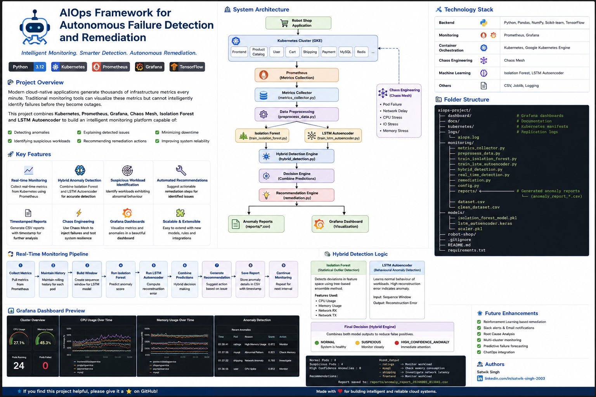
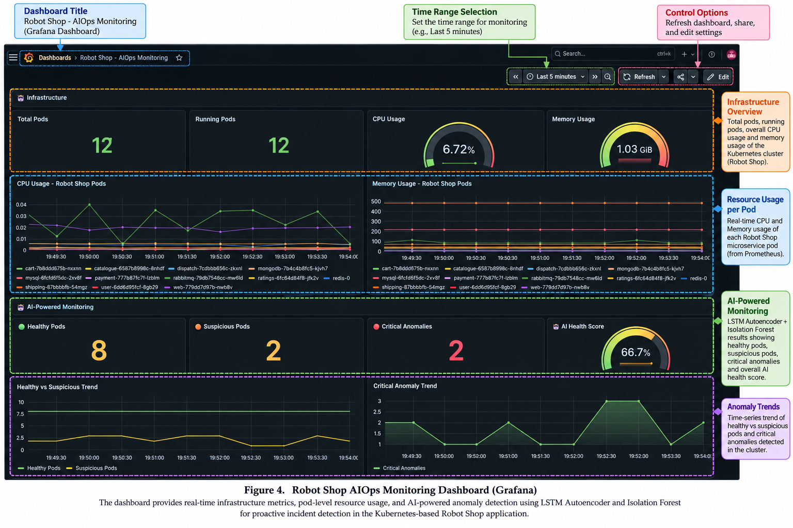
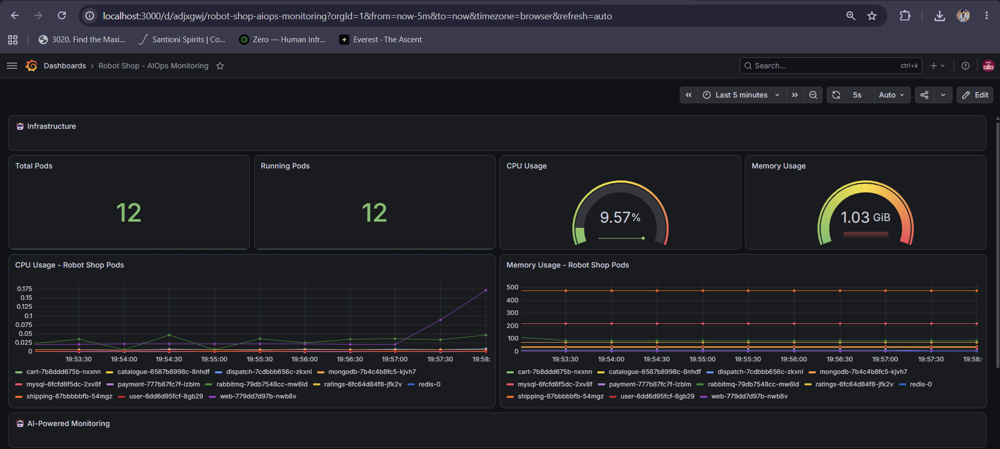
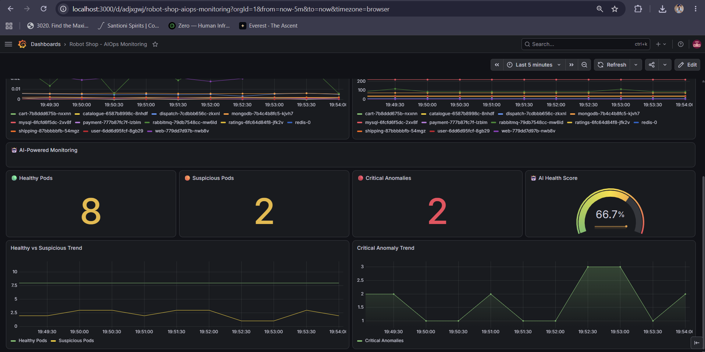
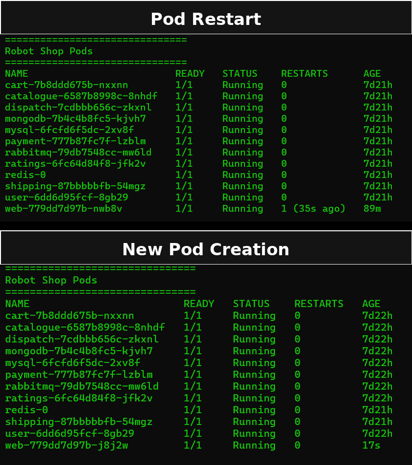

# 🤖 AIOps Framework for Autonomous Failure Detection and Remediation on Kubernetes


An intelligent AIOps framework that continuously monitors Kubernetes workloads, detects anomalies using Machine Learning, visualizes system health in Grafana, and provides intelligent remediation recommendations.

---

# 📌 Project Overview

Modern cloud-native applications deployed on Kubernetes generate thousands of infrastructure metrics every minute. Traditional monitoring tools visualize these metrics but cannot intelligently identify abnormal behaviour before it impacts production.

This project combines Machine Learning with Kubernetes monitoring and Chaos Engineering to build an intelligent AIOps platform capable of:

- Real-time Kubernetes monitoring
- Hybrid anomaly detection
- AI-powered health scoring
- Intelligent remediation recommendations
- Chaos Engineering validation
- Kubernetes self-healing visualization

---

# 🎯 Objectives

- Monitor Kubernetes workloads in real time
- Detect abnormal pod behaviour using Machine Learning
- Validate the system using Chaos Mesh
- Visualize infrastructure and AI metrics
- Generate anomaly reports
- Demonstrate Kubernetes self-healing

---

# 🏗️ System Architecture

<p align="center">

</p>

The framework follows the pipeline below:

```
Chaos Mesh
      │
      ▼
Robot Shop Application (GKE)
      │
      ▼
Kubernetes Metrics
      │
      ▼
Prometheus
      │
      ▼
Metrics Collector
      │
      ▼
Data Preprocessing
      │
      ▼
Hybrid Detection Engine
 ┌─────────────────────────┐
 │ Isolation Forest        │
 ├─────────────────────────┤
 │ LSTM Autoencoder        │
 └─────────────────────────┘
      │
      ▼
Decision Engine
      │
      ▼
Recommendation Engine
      │
      ▼
Prometheus Custom Metrics
      │
      ▼
Grafana Dashboard
```

---

# 🚀 Features

### Infrastructure Monitoring

- CPU Usage
- Memory Usage
- Running Pods
- Pod-wise Resource Monitoring

### AI Monitoring

- Hybrid Anomaly Detection
- Healthy Pods
- Suspicious Pods
- Critical Anomalies
- AI Health Score
- Real-Time Monitoring

### Machine Learning

- Isolation Forest
- LSTM Autoencoder
- Hybrid Detection Logic

### Chaos Engineering

- CPU Stress
- Memory Stress
- Network Delay
- Pod Kill

### Recommendation Engine

Provides intelligent recommendations such as:

- Restart Pod
- Scale Deployment
- Investigate CPU Spike
- Investigate Memory Leak
- Investigate Network Latency

---

# ⚙️ Technology Stack

## Cloud

- Google Kubernetes Engine (GKE)

## Containerization

- Docker

## Container Orchestration

- Kubernetes

## Monitoring

- Prometheus
- Grafana

## Chaos Engineering

- Chaos Mesh

## Machine Learning

- Isolation Forest
- LSTM Autoencoder

## Backend

- Python
- Pandas
- NumPy
- Scikit-Learn
- TensorFlow / Keras

---

# 📂 Project Structure

```text
aiops-project/

├── assets/
├── chaos/
├── dashboard/
├── kubernetes/
├── monitoring/
├── models/
├── reports/
├── robot-shop/
├── README.md
└── requirements.txt
```

---

# 🔄 Hybrid Detection Logic

The framework combines two Machine Learning models.

## Isolation Forest

Detects statistical outliers using infrastructure metrics such as:

- CPU
- Memory
- Network RX
- Network TX

---

## LSTM Autoencoder

Learns the normal behaviour of workloads and computes reconstruction error.

Higher reconstruction error indicates abnormal behaviour.

---

## Decision Engine

The predictions from both models are combined to classify workloads into:

- ✅ Normal
- ⚠️ Suspicious
- 🚨 High Confidence Anomaly

Combining both models reduces false positives and improves anomaly detection accuracy.

---

# 📈 Real-Time Monitoring Pipeline

1. Collect Prometheus metrics
2. Preprocess workload metrics
3. Build rolling history
4. Run Isolation Forest
5. Run LSTM Autoencoder
6. Combine predictions
7. Generate recommendations
8. Export Prometheus metrics
9. Update Grafana Dashboard

---

# 🔥 Chaos Engineering

The framework has been validated using Chaos Mesh.

Supported experiments:

- CPU Stress
- Memory Stress
- Network Delay
- Pod Kill

These experiments verify that the anomaly detection system reacts to infrastructure failures under controlled conditions.

---

# 📊 Grafana Dashboard

The dashboard provides:

- Infrastructure Monitoring
- CPU Usage
- Memory Usage
- Healthy Pods
- Suspicious Pods
- Critical Anomalies
- AI Health Score
- Resource Trends

<p align="center">

</p>

---

# 🧪 Demonstration Workflow

```
Normal Cluster
      │
      ▼
Inject CPU Stress
      │
      ▼
Prometheus Collects Metrics
      │
      ▼
Isolation Forest Detects Anomaly
      │
      ▼
LSTM Confirms Anomaly
      │
      ▼
Recommendation Generated
      │
      ▼
Grafana Dashboard Updated
      │
      ▼
Chaos Experiment Ends
      │
      ▼
Cluster Returns to Normal
```

---

# 📸 Project Screenshots

## System Architecture


---

## Grafana Dashboard


---

## CPU Stress Experiment



---

## AI Monitoring



---

## Recovery



---

# 📝 Sample Output

```
Healthy Pods                : 8

Suspicious Pods             : 2

Critical Anomalies          : 1

AI Health Score             : 66.7%

Recommendations

ratings   → Monitor workload

shipping  → Investigate network latency

mysql     → Check memory utilization
```

---

# 🛡️ Kubernetes Self-Healing

When failures such as pod termination occur, Kubernetes Deployment controllers automatically recreate the failed pod to maintain the desired state.

The AI layer continuously monitors these events, detects anomalies, and generates intelligent remediation recommendations.

---

# 🔮 Future Enhancements

- Reinforcement Learning based remediation agent
- Automatic Kubernetes scaling
- Root Cause Analysis
- Slack & Microsoft Teams notifications
- Alertmanager integration
- Multi-cluster monitoring
- Predictive failure forecasting

---

# 👨‍💻 Team

**Code Crafters**

- Atul Kumar
- Avani Thumballi
- Abhishek Kumar
- Satwik Singh

---

# 📄 License

This project has been developed for academic and research purposes.
# System Architecture plotted

                          +----------------------+
                          |     Chaos Mesh       |
                          | Failure Injection    |
                          +----------+-----------+
                                     |
                                     v
                     +-------------------------------+
                     | Robot Shop on Kubernetes (GKE)|
                     +---------------+---------------+
                                     |
                                     v
                         +-----------------------+
                         |     Prometheus        |
                         +-----------+-----------+
                                     |
                                     v
                        +-------------------------+
                        |  Metrics Collector      |
                        +-----------+-------------+
                                    |
                                    v
                      +-----------------------------+
                      | Data Preprocessing Pipeline |
                      +-----------+-----------------+
                                  |
              +-------------------+-------------------+
              |                                       |
              v                                       v
     +-------------------+                 +----------------------+
     | Isolation Forest  |                 | LSTM Autoencoder     |
     +---------+---------+                 +----------+-----------+
               \                                 /
                \                               /
                 +-------------+---------------+
                               |
                               v
                  +---------------------------+
                  | Hybrid Decision Engine    |
                  +------------+--------------+
                               |
                               v
                  +---------------------------+
                  | Recommendation Engine     |
                  +------------+--------------+
                               |
                               +----------------+
                               |                |
                               v                v
                  +------------------+   +------------------+
                  | Prometheus Export|   | Anomaly Reports  |
                  +--------+---------+   +------------------+
                           |
                           v
                  +---------------------------+
                  |    Grafana Dashboard      |
                  +---------------------------+

## Automation Scripts

The project includes automation scripts to simplify setup and chaos testing.

### Start the Project

Run:

scripts/start-project.bat

This will:

- Connect to the GKE cluster
- Start Grafana port-forward
- Start Prometheus port-forward
- Open Grafana
- Open Prometheus
- Open Robot Shop

### AIOps Control Center

Run:

scripts/aiops-control-center.bat

Features:

- Start the project
- Check cluster health
- Open Robot Shop
- Open Grafana
- Open Prometheus
- CPU Stress
- Memory Stress
- Network Delay
- Pod Kill
- Cleanup Chaos
